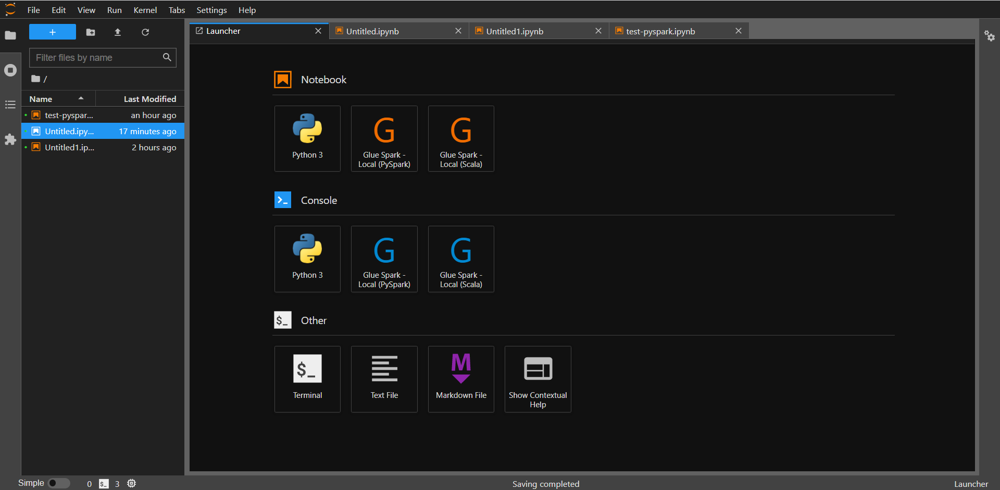

# aws-glue-libs-docker
Run Glue job locally with docker for AWS China Region particularly because the current version of aws-glue-libs(https://github.com/awslabs/aws-glue-libs) does not support China Region.  

This is based on the image amazon/aws-glue-libs:glue_libs_3.0.0_image_01. While accessing AWS S3, it goes to global AWS region by default. We use core-site.xml to specify China Region S3 endpoint.

        <property>
            <name>fs.s3a.endpoint</name>
            <value>s3.cn-north-1.amazonaws.com.cn</value>
        </property>

If you are using Ningxia Region (ZHY), please change to s3.cn-northwest-1.amazonaws.com.cn.  

这个方案是特别为在AWS中国区域(北京和宁夏)运行本地Glue容器作为开发测试. 由于现有aws-glue-libs的bug,我们需要特别指定S3的endpoint.

## Pre-requisite

Setup your default profile of AWS AKSK by 'aws configure' 

请先配置好AWS的账号信息,需要预先AWS CLI.

## Step on Linux or Mac
1. Clone

        git clone https://github.com/xmubeta/aws-glue-libs-docker.git

2. Setup

        cd aws-glue-libs-docker  
        bash setup.sh  

3. Run

        bash run.sh

4. Access the notebook

        https://localhost:8888

        Try test-pyspark notebook (change S3 path first.)

    

